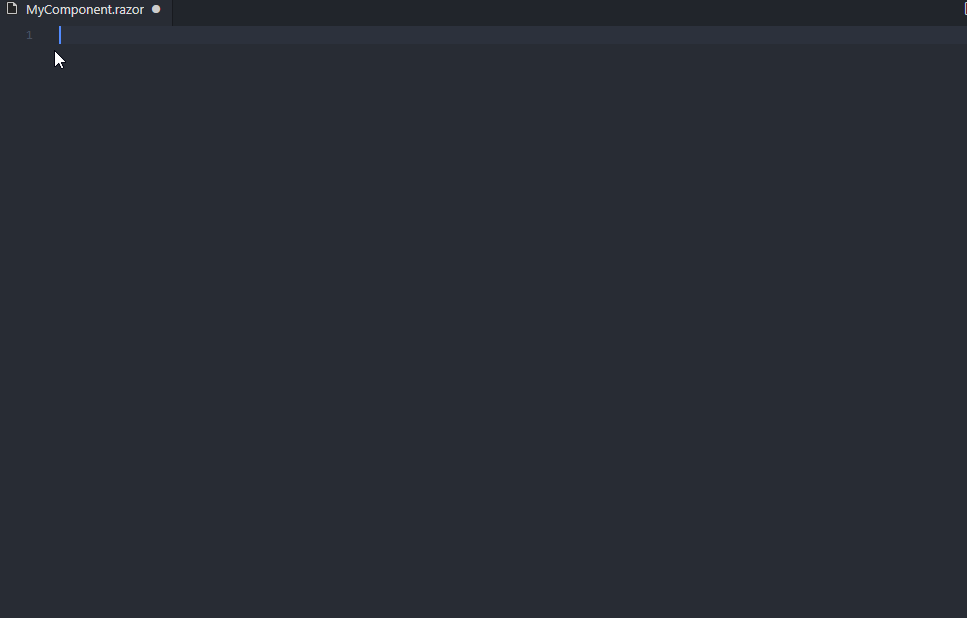

# Blazor Snippet Pack

*Created with [https://vscodesnippetgenerator.azurewebsites.net/](https://vscodesnippetgenerator.azurewebsites.net/) \([GitHub](https://github.com/AdrianWilczynski/VSCodeSnippetGenerator/)\)*

A snippet pack for Blazor\.

## C\#

| Prefix | Description |
| ------ | ----------- |
| bl\-authStateTask | AuthenticationStateTask Parameter |
| bl\-code\-behind | Component Code Behind |
| bl\-eventCallback | Event Callback |
| bl\-eventCallback\-changed | Event Callback On Parameter Changed |
| bl\-eventHandler | Event Handler |
| bl\-eventHandler\-async | Async Event Handler |
| bl\-js\-invoke | Invoke JavaScript Function |
| bl\-notifier\-service | Notifier Service |
| bl\-onAfterRender | OnAfterRender |
| bl\-onAfterRender\-async | OnAfterRenderAsync |
| bl\-onInitialized | OnInitialized |
| bl\-onInitialized\-async | OnInitializedAsync |
| bl\-onParametersSet | OnParametersSet |
| bl\-onParametersSet\-async | OnParametersSetAsync |
| bl\-param | Parameter |
| bl\-param\-cascading | Cascading Parameter |
| bl\-param\-unmatched | Parameter Capturing Unmatched Values  |
| bl\-setParameters\-async | SetParametersAsync |
| bl\-shouldRender | ShouldRender |

## Razor

| Prefix | Description |
| ------ | ----------- |
| bl\-attributes | @attributes Attribute |
| bl\-authorize | @attribute \[Authorize\] Directive |
| bl\-authorizeView | AuthorizeView Component |
| bl\-authorizeView\-not | AuthorizeView Component with NotAuthorized section |
| bl\-authorizeView\-roles | AuthorizeView Component using Roles |
| bl\-bind | @bind Attribute |
| bl\-bind\-event | @bind\-value:event Attribute |
| bl\-bind\-format | @bind:format Attribute |
| bl\-bind\-value | @bind\-Value Attribute |
| bl\-cascadingValue | CascadingValue Component |
| bl\-code | Code Block |
| bl\-component | Component |
| bl\-component\-child | Component with Child Content |
| bl\-component\-disposable | Disposable Component |
| bl\-component\-http | Component with HTTP call |
| bl\-component\-layout | Layout Component |
| bl\-component\-notify | Component receiving notifications |
| bl\-component\-tag\-helper | Component Tag Helper |
| bl\-component\-tag\-helper\-param | Component Tag Helper with Parameter |
| bl\-component\-templated | Templated Component |
| bl\-form | Form with validation |
| bl\-form\-group | Form Group \(label, input, validation message\) |
| bl\-form\-group\-bootstrap | Form Group with Bootstrap classes |
| bl\-form\-group\-html | Form Group \(HTML Elements\) |
| bl\-form\-group\-html\-bootstrap | Form Group \(HTML Elements\) with Bootstrap classes |
| bl\-implements | @implements Directive |
| bl\-inject | @inject Directive |
| bl\-inject\-http | @inject HttpClient Directive |
| bl\-inject\-js | @inject JSRuntime Directive |
| bl\-layout | @layout Directive |
| bl\-navlink | NavLink |
| bl\-navlink\-match | NavLink with Match attribute |
| bl\-owningComponentBase | @inherits OwningComponentBase Directive |
| bl\-page | @page Directive |
| bl\-page\-param | @page Directive with Parameter |
| bl\-preventDefault | @event:preventDefault Attribute |
| bl\-ref | @ref Attribute |
| bl\-typeparam | @typeparam Directive |
| bl\-using | @using Directive |
| bl\-validationMessage | ValidationMessage Component |

## HTML

| Prefix | Description |
| ------ | ----------- |
| github\-pages\-base | Base Path |
| github\-pages\-spa\-404 | 404 \- Single Page Apps for GitHub Pages |
| github\-pages\-spa\-index | Index Script \- Single Page Apps for GitHub Pages |

## \.csproj \(XML, MSBuild\)

| Prefix | Description |
| ------ | ----------- |
| bl\-disable\-link | Disable LinkOnBuild  |